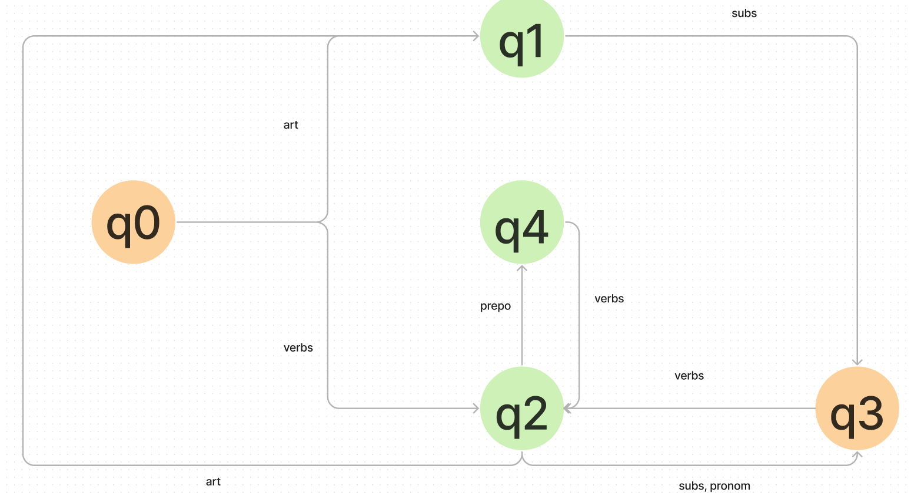

# Autômato Finito Determinístico

Projeto realizado para a disciplina de Linguagens Formais,
Automatos e Computabilidade

## Integrantes:

- Alexia Cassiane de Siqueira Lima
- Carla Kremer de Oliveira
- Guilherme Henrique Custodio
- Natan Duarte Procópio

## Limitações

- Apenas reconhece as frases ja estabelecidas

---

## Dependências e como executar

- NLKT e suas dependências (veja [requirements.txt](./requirements.txt) para mais detalhes)

- no Windows

```powershell
py -m venv venv
.\venv\Scripst\activate
pip install -r requirements.txt
```

execute com:

```powershell
py .\example.py #ou main.py
```

- no Linux/mac?

```shell
python3 -m venv venv
source myvenv/bin/activate
pip3 install -r requirements.txt #or just pip
```

```shell
python3 example.py #ou main.py
```

---

## Autômatos 
### Gramática

```shell
AFD Gramática: G = {Q, Σ, S, F}
Q = {q0,q1,q2,q3,q4,q5,q6,q7,q8},
Σ = {' ', 'a', 'b', 'c', 'd', 'e', 'g', 'h', 'i', 'j', 'l', 'm', 'n', 'o', 'p', 'r', 's', 't', 'u','v', 'z'},
S = q0,
F = q8
```


```shell
AFD intenções: I = {Q, Σ, S, F}
Q = {q0,q1,q2,q3,q4},
Σ = {'verbs', 'art', 'subs' 'prepo', 'pronom'},
S = q0,
F = q3
```

### Autômato Finito Deterministico


### Autômato finito de intenções


